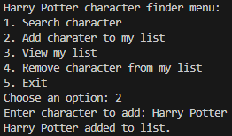
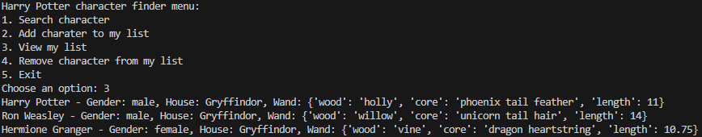

# Harry Potter Characters

## Description
My project gives information about Harry Potter characters to the user. It shows their name, nicknames, gender house and wand, giving basic information about whoever. It exists to remind the user the basic information needed about the characters to read the story and offers a quicker way for readers to get reminded rather than them having to go back and reread the book to find the forgotten information. 

## Visuals
**Searching for a character**

**Adding a character to the list**

**Removing a character from the list**

## Installation
To install the modeules/dependancies needed throughout the program type or copy into the terminal : "pip install -r requirements.txt", and press enter Then if it still shows a yellow squiggly line under the word requests in 'functions.py' close the vs code tab and reopen it. 

## Usage
As shown in the earlier images, you need to:
1. Choose a number and press enter where it displays "Choose an option: ".
2. Depending on the option you chose, you may either have to enter the name of a character or just read the output provided.
3. If an output has not already been provided, it should have by now.
4. Continue to repeat this procedure until you want to exit the program. In that case, enter "5" when it displays, "Choose an option: ".

## Technologies Used
- Python language
- Harry Potter character API 
- Command-Line Interface
- pip